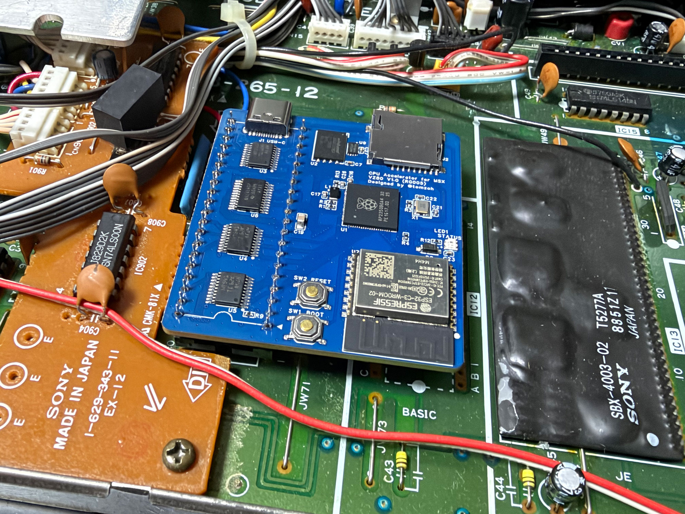
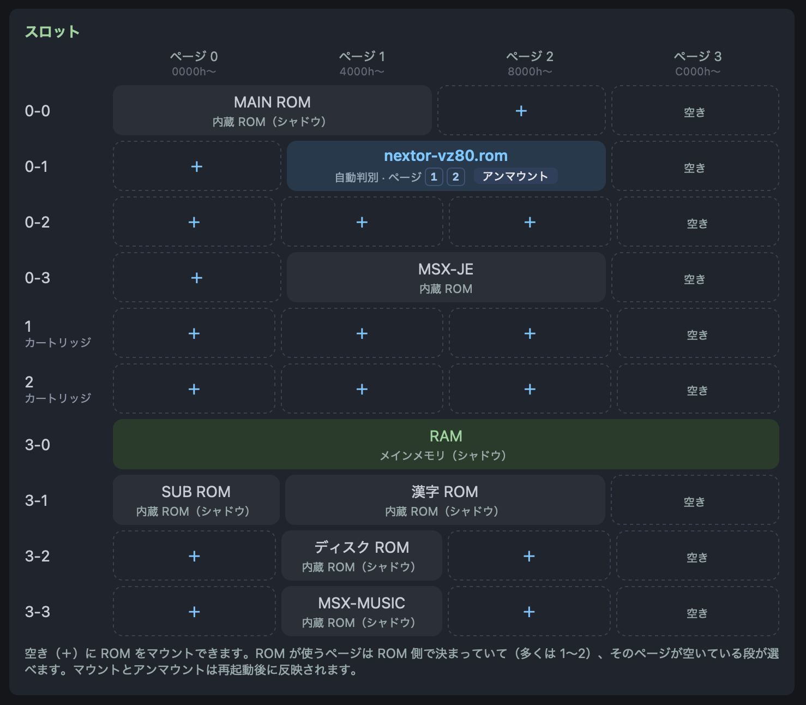
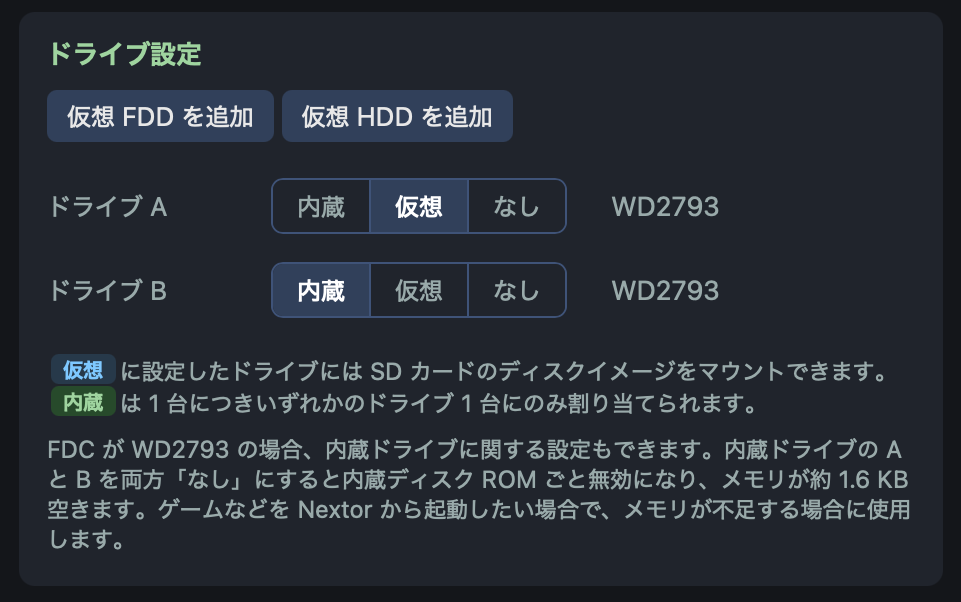
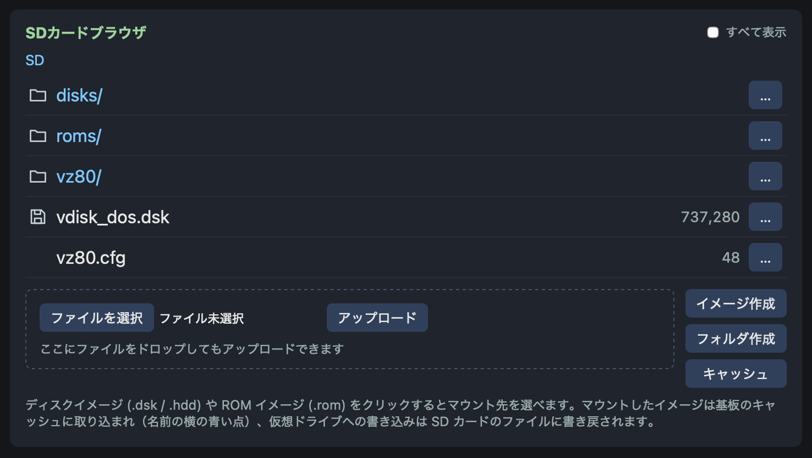

# vz80

RP2350とESP32を使ったMSX用多機能CPUアクセラレータ

## 概要

Z80が搭載されたMSX向けのCPUアクセラレータです。    
CPU動作を担当するメインプロセッサとしてRP2350を、Wi-Fi接続やSDカードアクセスを担当するサブプロセッサとしてESP32を使用しています。  
CPUアクセラレータとしての機能だけでなく、MSXの機能を拡張するいくつかの機能も持っています。
  
## システム要件

* MSX
  * 現在はSONY HB-F1XDJでのみ動作確認しています。
  * 理論上はDIPパッケージのZ80を搭載したMSXで動作するはずです。

## 基板バージョン

  * V1.0: 初版
  * V2.0: （未頒布）: RP2350 と ESP32 の接続を変更し、SDカードへのアクセス速度が向上した版。基板上のコネクタからサウンドが出力されます。

V2.0については今後頒布予定です。うまく動作しないなどの理由でキャンセルする可能性もあります。

## 機能

### CPU 機能

SONY HB-F1XDJで使用時に、BASICでの単純な 3,000回ループでZ80比19.0倍、MSXturboR比で3.41倍のパフォーマンスが出ています。（RP2350 を 300MHz 動作した時）  
  
* 命令実行時にウェイトをかけ、MSX2+相当, MSXturboR相当での動作もできます。
* MSX のメインメモリを使用せず、 RP2350のRAMをMSXのメインメモリとして使用することでパフォーマンスを上げています。
* 最大1,024KBのメモリをMSXのメインRAM（メモリマッパ）として使用できます。
* VDPへのアクセスを間隔を設定しCPUが高速動作してもVDPが正常に動作する様にしています。
* MSXに内蔵された一部のROMをRP2350のRAMにコピー（シャドウ）して使用することでパフォーマンスを上げています。

### 周辺機器機能

* 仮想FDD/HDD: 
  * FDCがWD2793であれば内蔵FDDに加えて仮想FDDをドライブA, Bに割り当てられます
  * VZ80用のNextor ROMを使用すると仮想FDDや仮想HDDドライブを追加できます
  * 仮想FDD/仮想HDDにはSDカードに格納したイメージファイルをマウントできます
* 仮想ROM:
  * SDカードに格納したROMファイルをマウントできます
  * メガROMをマウントする場合、マッパは自動判別されます

### Web UI 機能

* CPU設定:
  * 動作速度を MSX2 相当, MSXturboR相当, Max（最大速度）から設定できます
  * CPU から VDP のアクセス間隔を 6μs, 7μs, 8μs, 12μs から選択して設定できます
  * RP2350 の動作クロックを設定できます
  * メインメモリの容量を 64KB, 256KB, 512KB, 1,024KB から選択して設定できます
* システム設定
  * ホスト名（ヘッダや "近くの機器" に表示）を設定できます
  * 基板上のLEDを光らせる "この機器を探す" を実行できます
  * MSXを再起動できます
* ドライブ設定
  * Nextor が設定されている場合、仮想FDD/仮想HDDを追加・削除できます
  * FDC が WD2793 の機種では、A/B それぞれのドライブを、内蔵ドライブ/仮想ドライブに設定できます。
* ドライブ
  * ドライブ設定で設定した仮想FDD, 仮想HDD にSDカードに格納したイメージをマウントできます
* スロット
  * MSX のスロットマップを表示します
  * スロットの空いている場所に SD カードの .rom ファイルをマウントできます
* 画面
  * MSXで現在表示している画面をWeb UIの中に表示・ダウンロードできます（静止画）
  * MSXにキーを送信できます
  * 指定した間隔で自動更新します
* SDカードブラウザ
  * VZ80にセットされたSDカードの内容をブラウズできます
  * テキストファイルを編集できます
* ファームウェアをアップデートできます
* RG002 VFD68, RG003 VHD68, RG004 VMPU68, RG005 VZ80 が同一ネットワーク内にあれば一覧表示し、そのWeb UIを開けます
* macOS の Safari と Chrome で動作確認しています

## セットアップ

### microSDカードの作成

1. microSDカードをFAT32でフォーマットする
  * 64GB以上のSDカードはexFATで出荷されているものが多いので FAT32でフォーマットしなおしてください
2. `vz80.cfg.sample` を `vz80.cfg` という名前でSDカードのルートにコピーし、接続したいWi-Fi APの `ssid=` と `pass=` を記入する
  * `vz80.cfg.sample` はこのリポジトリの `release/config/` にあります
  * Wi-Fi接続しなくても動作しますが、ほとんどの設定はWi-Fi経由のWeb UIからすることになりますのでWi-Fi接続推奨です
3. 必要に応じてディスクイメージ（`.dsk` / `.hdd`）と ROM（`.rom`）をコピーする
  * フォルダ配下に置いても使用できます
  * 付属の nextor-vz80.rom を使用するとHDDイメージや追加の仮想FDDを使えます
    * HB-F1XDJはじめWD2793を使用している機種では nextor-vz80.rom を使用しなくても仮想FDDを使えます

### MSX本体への取付

VZ80は現時点では SONY HB-F1XDJ でのみ動作確認できています。  
HB-F1XDJ 以外でもZ80が搭載されたMSX機で、物理的に取付ができれば動作すると期待しています。  
   
MSX本体への取付は以下の手順で実施します。
  
1. MSX本体からZ80を取り外す
2. ICソケットを半田付けする
   * BOOTH頒布のものはICソケットが付属します
3. ICソケットにVZ80を取り付ける
   * 向きに気をつけて、まっすぐ上から押し込んでください
4. VZ80の表面や底面とMSX本体の部品などが接触していないか確認してください
   * HB-F1XDJとVZ80 V1.0の組み合わせではVZ80右下のESP32-C3がキーボード下部に少し接触します。接触する箇所にマスキングテープやビニールテープなどを貼っておくと少し安心です。

写真はHB-F1XDJにVZ80 V1.0を取り付けた様子です

#### 起動

取付が完了したらACプラグやディスプレイを接続してMSXの電源を入れます。  
通常通りMSXが起動しない場合はACプラグを抜いて接続を確認してください。  
  
Wi-Fi設定がされていればVZ80上のLEDが青に点滅し、接続完了すると青に点灯します。Wi-Fi 設定がされていない場合や、接続できなかった場合はLEDは緑に点灯します。  

tools/lan-finder/lan-finder.html を開いて[スキャン開始]ボタンを押すと同一LAN内のVZ80を検索できます。  
検出されたら[開く]ボタンでVZ80のWeb UIを開けます。

## 機能詳細

### 仮想ROMカートリッジ

ROMイメージをMSXのスロットに挿したように見せます。  
Web UI のスロット欄に実機のスロット×ページ（16KB）の表が表示されています。   

  
空き（`＋`）を押すとSDカードブラウザが開きます。SDカードブラウザからROMを選択すると指定したスロットにROMをマウント（挿入）できます。ROMが使うページはROM側で決まっています。  
  
ROMのマッパにも対応しています。対応マッパはプレーン, ASCII 8K, ASCII 16K, コナミ, コナミ SCCで、自動判別されます。  
  
マウント済のROMをアンマウントすることもできます。  
ROMのマウント/アンマウントはMSXの再起動後に反映されます。

### 仮想FDD

HB-F1XDJなどのWD2793採用機種ではそのまま、それ以外の機種でも付属の `nextor-vz80.rom` をいずれかの空きスロットにマウントすると、実ドライブに加えて仮想FDDを追加できます。  

▼WD2793機種の場合のドライブ設定  

仮想FDDにはSDカードに格納されたディスクイメージをマウントできます。  

### 仮想HDD

付属の `nextor-vz80.rom` をいずれかの空きスロットにマウントすると、仮想HDDを追加できます。  
仮想HDDも仮想FDD同様イメージをSDカードに作成して使用します。  

### SDカードブラウザ
  
SDカードの内容はWeb UIのSDカードブラウザに表示されています。

SDカードブラウザは以下の機能を持っています:

* ROMイメージ（`.rom`）、フロッピーディスクイメージ（`.dsk`）、ハードディスクイメージ（`.hdd`、または720KBより大きい `.dsk` /48MBまで）を仮想ROMカートリッジや仮想FDD/HDDとしてマウントする
* ファイルを移動・削除・リネームする
* テキストファイルを閲覧・編集する
* ファイルをSDカードにアップロードする
* 仮想FDD/HDD用のイメージファイルを作成する
* キャッシュを表示・削除する

### イメージのマウントとキャッシュ

VZ80には64MBのフラッシュメモリが搭載されています。  
VZ80ではこのフラッシュメモリをキャッシュとして使用し、ROM/フロッピーディスク/ハードディスクイメージのマウントはキャッシュに載せてから実施します。  
キャッシュの容量が足りなくなると一番過去に利用したイメージがキャッシュから削除されます。  
  
キャッシュ済みのファイルはSDカードブラウザ上で名前の横に青いドットが表示されます。  

### Nextor（VZ80 ディスクドライバ）

付属の `nextor-vz80.rom` （Nextor カーネルに vz80 用のデバイスドライバを組み込んだ ROM）をスロットにマウントすると、仮想FDD/仮想HDDを使えます。  
  
Web UIのドライブ設定のうちNextor表示のある行がNextor配下のドライブです。  
`仮想FDDを追加``仮想HDDを追加`でドライブを追加、`削除`で削除できます。ドライブの順番は`≡` をドラッグして変更できます。  
  
仮想FDDは720KB/360KBのフロッピーイメージ、仮想HDDは48MBまでのハードディスクイメージ（`.hdd`）が使えます。どちらもWeb UIの`イメージ作成`で作れます。  
  
- Nextorは内蔵ディスクROMより前のスロットにマウントしてください。起動時にマスタになり、`A:`からがNextorのドライブ、内蔵ドライブはその後ろのドライブ文字が割り当てられます。起動は`A:`のイメージからされます。（A: が仮想 HDD なら HDD から起動: NEXTOR.SYS と COMMAND2.COM をルートに入れておきます）
- ブートセクタがMSX-DOS 1形式のイメージ（内蔵ディスクROMでフォーマットしたものやWeb UI の`イメージ作成`のDOS1）で起動するとNextorはDOS 1モードで起動し、MSXDOS.SYSがあればMSX-DOS 1、なければDisk BASIC 1.0が起動します。
- ブートセクタがMSX-DOS 2形式のイメージで起動するとNextorはDOS 2モードで起動し、NEXTOR.SYS / COMMAND2.COMがあればNextorのDOS、なければNextor BASICが起動します。DOS 2モードを使用するにはメインメモリを128 KB以上に設定する必要があります。
- ハードディスクイメージ（FAT16）は DOS 2モードでだけ使えます。DOS 1モードで起動したときはドライブ文字は割り当てられますがアクセスできません。

### ステータス LED

基板上にステータスLEDを搭載しています。

* 白の速い点滅（10秒）: Web UIからの「この機器を探す」機能実行時
* 白: 起動時
* 赤: ディスク・フラッシュ書込中
* 青の点滅: Wi-Fi接続中
* 青: Wi-Fi接続済で動作中
* 緑: Wi-Fi接続なしに動作中

### ファームウェアアップデート

Web UIからファームウェアを更新できます。  

* このリポジトリの `release` に最新のファームウェアがあります。
* BOOTHでの頒布版は出荷前にファームウェアを書き込んで HB-F1XDJ で動作確認していますので、最初の起動時は `vz80.cfg` だけ置いて起動することをお勧めします。
* microSDカードのルートにファームウェアファイル（*.vzp）を置いてVZ80を起動してもファームウェア更新できます。
* ファームウェア更新時はテスト起動状態になります。テスト起動で問題無く20秒動作すると動作中のファームウェアが採用され、次回起動時にも更新したバージョンで起動します。問題があれば自動的にアップデート前のバージョンに戻ります。
* SDカードをVZ80に挿入するとマウント時にチェックされ、動作中のものより新しいバージョンのファームウェアが含まれればその場で更新されます。

## その他の仕様

### VDP（V9938）アクセス

VDPアクセスには一定の間隔を空ける必要がありますが、VZ80ではCPUが高速に動作するのでこの間隔を確保できないことがあります。  
そのため、VZ80ではVDPのポート（98H〜9BH）へのアクセスのたびに実時間を記録し、前回から規定の間隔が経つまで次のアクセスを待たせています。この設定はWeb UIのCPU設定→詳細→VDP アクセス間隔にあります。既定は8µsで、6 / 7 / 8 / 12 µs から選択できます。  

### 内蔵 MSX-MUSIC（YM2413）アクセス

VDP同様、内蔵 MSX-MUSICもアドレス書き込みの後12サイクル、データ書き込みの後84サイクルの間隔が必要です。VZ80は7Ch書込後4µsたってから7Dhに書き込み、7Dhの書込後は24µsたってから次の書き込みを実行しています。  
  
V1.0基板でのWeb UIからの再起動（`MSX を再起動`）はZ80だけをリセットするので、FM音源やPSGの内部状態は残ります（実機のリセットとは違います）。おかしな状態が残ったときはMSXの電源を入れ直してください。

